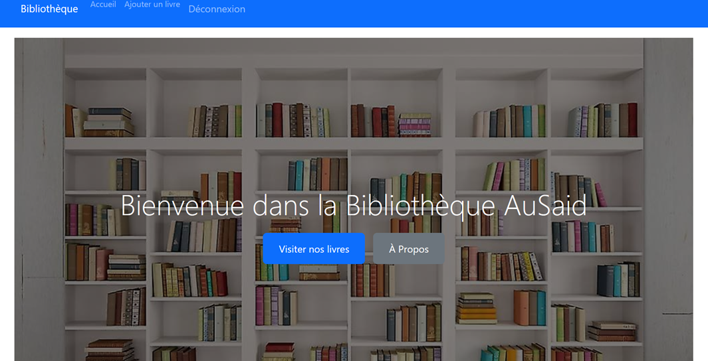
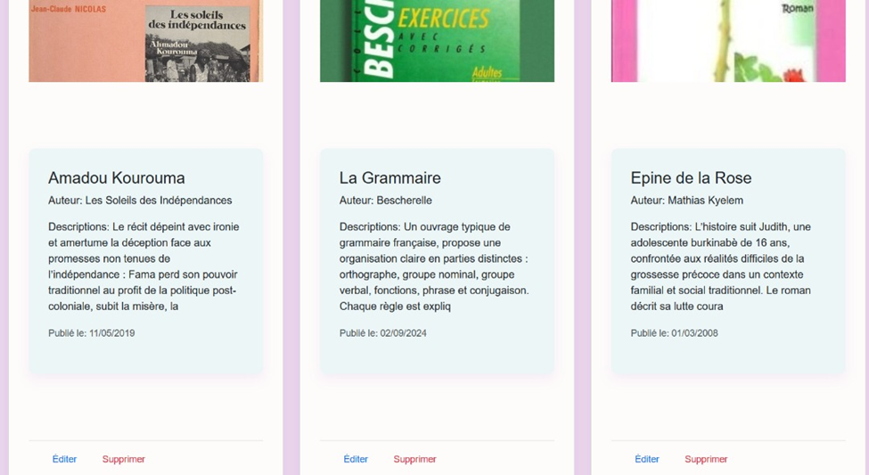
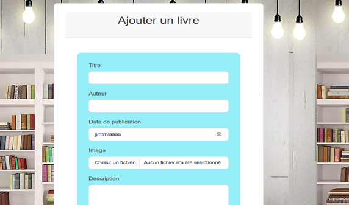
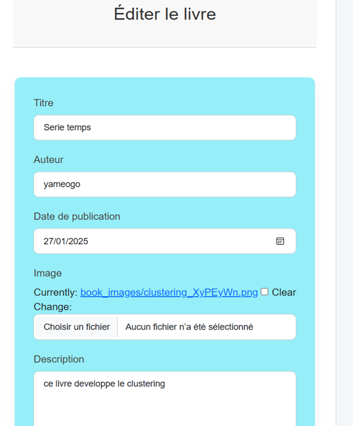
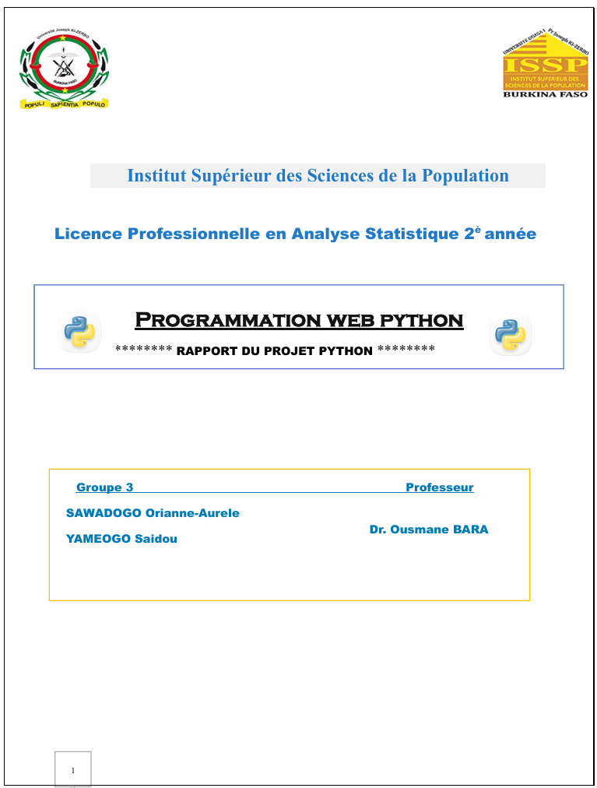

<p align="center">


</p>


<p align="center">
  <a href="#">
    
  </a>

  <a href="README_EN.md">
    
  </a>
</p>

# Résumé

*Ce projet a consisté en le développement d'une application web de gestion de bibliothèque numérique, utilisant le framework Django en Python. L'objectif principal était de créer une plateforme sécurisée permettant aux utilisateurs (gestionnaires et visiteurs) d'interagir avec un catalogue de livres. Les fonctionnalités clés incluent la création, la lecture, la mise à jour et la suppression (CRUD) de livres, ainsi que la gestion des utilisateurs et des accès.*

### 🚀 Principales fonctionnalités

✔ Développement d'une application web sécurisée avec Django

✔ Gestion complète des livres (ajout, modification, suppression, consultation)

✔ Système d'authentification et d'autorisation des utilisateurs

✔ Distinction entre utilisateurs gestionnaires et visiteurs

✔ Interface d'administration pour la gestion des données

✔ Conception d'une interface utilisateur responsive

**Compétences mobilisées :** Développement web, Python, Django, ORM, bases de données, gestion des utilisateurs, CRUD, HTML, CSS, sécurité web.


# 📌 Contexte

Le développement d'applications web robustes et sécurisées est une compétence essentielle dans le domaine de l'analyse de données et de la science des données, notamment pour la création d'outils internes ou la valorisation de projets. Ce projet s'inscrit dans le cadre d'une formation en Analyse Statistique, visant à explorer les capacités du framework web Django pour la mise en œuvre d'un système de gestion de bibliothèque numérique.

> 💡 **Problématique :**
>
> Comment concevoir et implémenter une application web de gestion de bibliothèque sécurisée et fonctionnelle, capable de gérer les opérations CRUD sur les livres et de distinguer les rôles des utilisateurs (gestionnaires et visiteurs) en utilisant le framework Django ?


# 🎯 Objectifs

### Objectif général

Développer une application web de gestion de bibliothèque numérique complète et sécurisée avec Django.

### Objectifs spécifiques

- Mettre en place un environnement de développement Django.
- Concevoir et implémenter les modèles de données pour les livres et les utilisateurs.
- Développer les fonctionnalités CRUD pour la gestion des livres.
- Intégrer un système d'authentification et d'autorisation pour différents types d'utilisateurs.
- Créer une interface utilisateur intuitive et responsive pour le frontend.
- Assurer la sécurité de l'application et la gestion des accès.
- Démontrer la capacité à utiliser un framework web pour des projets de développement.


# 🗂️ Données

<table>

<tr>

<td width="35%" valign="top">

<h3 align="center">Sources</h3>

| Élément | Description |
|----------|------------|
| Type de données | Informations sur les livres, données utilisateurs |
| Base de données | SQLite (par défaut avec Django), extensible à d'autres SGBD |
| Fichiers | Images de couverture des livres |
| Environnement | Développement local |

</td>

<td width="65%" valign="top">

<h3 align="center">Variables retenues (Modèle `Book`)</h3>

| Variable | Description |
|-----------|------------|
| `title` | Titre du livre |
| `author` | Auteur du livre |
| `pub_date` | Date de publication |
| `image` | Image de couverture |
| `description` | Résumé ou description du livre |

</td>

</tr>

</table>


# 🔬 Méthodologie

```text
Initialisation du projet Django
        │
        ▼
Conception des modèles (ORM)
        │
        ▼
Implémentation du Backend (Vues, URLs)
        │
        ▼
Développement du Frontend (Templates HTML/CSS)
        │
        ▼
Gestion de l'authentification et des autorisations
        │
        ▼
Intégration des opérations CRUD
        │
        ▼
Tests et Déploiement local
```

### Étapes réalisées

#### 1. Initialisation du projet et de l'application

Mise en place de l'environnement virtuel, installation de Django, création du projet `bibliotheque` et de l'application `booksApp`.

#### 2. Conception des modèles de données

Définition du modèle `Book` avec ses attributs (`title`, `author`, `pub_date`, `image`, `description`) et configuration de l'administration Django pour ces modèles.

#### 3. Développement du Backend

Implémentation des vues (fonctions Python) et des URLs pour gérer les opérations CRUD (Create, Read, Update, Delete) sur les livres, ainsi que l'authentification des utilisateurs.

#### 4. Développement du Frontend

Création des templates HTML et des styles CSS pour les différentes pages de l'application : page de connexion, page d'accueil, affichage des livres, formulaires d'ajout, de modification et de suppression.

#### 5. Gestion des utilisateurs et des accès

Mise en place d'un système d'authentification pour les gestionnaires et les visiteurs, avec des niveaux d'autorisation distincts pour les opérations de gestion des livres.

#### 6. Tests et validation

Tests des différentes fonctionnalités pour s'assurer de leur bon fonctionnement et de la sécurité de l'application.


# 🛠️ Stack technique

<p align="center">


</p>


# 📊 Résultats

L'application web développée est fonctionnelle et permet une gestion complète d'une bibliothèque numérique. Les principales interfaces et fonctionnalités sont présentées ci-dessous.

## Visualisations

### Page de connexion


### Page d'accueil (Visiteur)



### Exploration des livres



### Formulaire d'ajout de livre




### Formulaire de modification de livre




# 💡 Interprétation

Le projet démontre avec succès la capacité à construire une application web complète en utilisant le framework Django. La distinction entre les rôles d'utilisateurs (gestionnaires et visiteurs) est bien implémentée, offrant des niveaux d'accès et des fonctionnalités adaptés à chaque profil. Les opérations CRUD sur les livres sont fonctionnelles, permettant une gestion efficace du catalogue. L'interface utilisateur, bien que simple, est intuitive et permet une navigation fluide.


# 🌍 Impact

Ce projet a permis de renforcer les compétences en développement web avec Python et Django, essentielles pour la création d'outils personnalisés ou la participation à des projets de plus grande envergure. Il illustre la capacité à : 

- Concevoir et implémenter des architectures web sécurisées.
- Gérer des bases de données via un ORM.
- Développer des interfaces utilisateur fonctionnelles.
- Appliquer les principes du développement agile (bien que non formellement mentionné, le processus itératif est implicite).
- Contribuer à des projets nécessitant des compétences en full-stack development.


# ⚠️ Limites

> [!WARNING]
>
> L'application est un prototype fonctionnel et pourrait être améliorée en termes de design UI/UX, de fonctionnalités avancées (recherche, filtres, pagination) et de robustesse (gestion des erreurs, tests unitaires).

> [!WARNING]
>
> Le déploiement de l'application est actuellement limité à un environnement local. Un déploiement en production nécessiterait des configurations supplémentaires (serveur web, base de données de production, sécurité renforcée).


# 🧠 Compétences développées

| Domaine | Compétences |
|----------|------------|
| Développement Web | Django, Python, HTML, CSS |
| Bases de données | Modélisation de données, ORM Django, SQLite |
| Gestion de projet | Conception, implémentation, tests |
| Sécurité Web | Authentification, autorisation |
| Programmation | Python (avancé) |
| Frontend | Intégration de templates, responsive design |


# 👥 Équipe & Encadrement

## Réalisé par

<table align="center">

<tr>

<td align="center">

<b>SAWADOGO Oriane-Aurele</b><br/>
<sub>Licence Professionnelle en Analyse Statistique</sub>
<br/>

<a href="[TON_LIEN_GITHUB_SAWADOGO]">


</a>
</td>

<td align="center">

<b>YAMEOGO Saïdou</b><br/>
<sub>Licence Professionnelle en Analyse Statistique</sub><br/>

<a href="yamsaid">


</a>

</td>

</tr>

</table>

## Encadrement

<table align="center">

<tr>

<td align="center">

<b>Dr. Ousmane BARA</b><br/>
<sub>Professeur</sub><br/>
<sub>Institut Supérieur des Sciences de la Population (ISSP)</sub><br/>
<sub>Université Joseph Ki-Zerbo · Burkina Faso 🇧🇫</sub>

</td>

</tr>

</table>


# 📁 Structure du projet

```text
📦 mon_projet_bibliotheque/
├── README.md
├── Rapport.pdf
├── manage.py
├── bibliotheque/           # Projet Django principal
│   ├── __init__.py
│   ├── asgi.py
│   ├── settings.py
│   ├── urls.py
│   └── wsgi.py
├── booksApp/               # Application Django pour les livres
│   ├── migrations/
│   ├── __init__.py
│   ├── admin.py
│   ├── apps.py
│   ├── models.py
│   ├── tests.py
│   └── views.py
├── templates/              # Fichiers HTML du frontend
│   ├── base.html
│   ├── login.html
│   ├── home.html
│   └── about.html
├── static/                 # Fichiers statiques (CSS, JS, images)
│   ├── css/
│   ├── js/
│   └── images/
└── media/                  # Fichiers uploadés (media/images de livres)
```


## 🔧 Installation et Configuration

### Prérequis
```bash
Python 3.8+
pip
```

### Installation
```bash
# Cloner le repository
git clone [url-du-repo]

# Créer un environnement virtuel
python -m venv venv
source venv/bin/activate  # Linux/Mac
# ou
venv\Scripts\activate     # Windows

# Installer les dépendances
pip install -r requirements.txt

# Appliquer les migrations
python manage.py migrate

# Créer un superutilisateur
python manage.py createsuperuser

# Lancer le serveur
python manage.py runserver
```

# 📄 Lire le rapport

<p align="center">



</p>

<p align="center">

<a href="documents/rapport.pdf">


</a>

</p>


# 📚 Références bibliographiques

- Django Documentation Officielle. *The Web framework for perfectionists with deadlines.* [TON_LIEN_DOC_DJANGO]
- Python Software Foundation. *Python Documentation.* [TON_LIEN_DOC_PYTHON]
- W3C. *HTML and CSS Standards.* [TON_LIEN_DOC_HTML_CSS]


<p align="center">
  <sub>Projet réalisé dans le cadre de la Licence Professionnelle en Analyse Statistique à l'Institut Supérieur des Sciences de la Population (ISSP), Université Joseph Ki-Zerbo, Burkina Faso.</sub>
</p>
